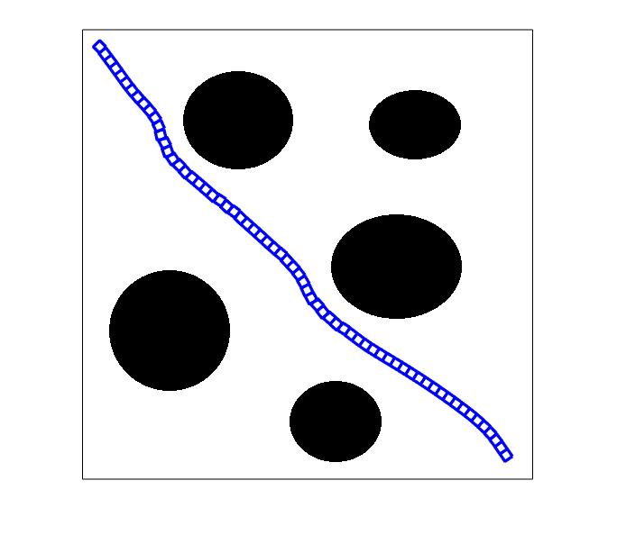
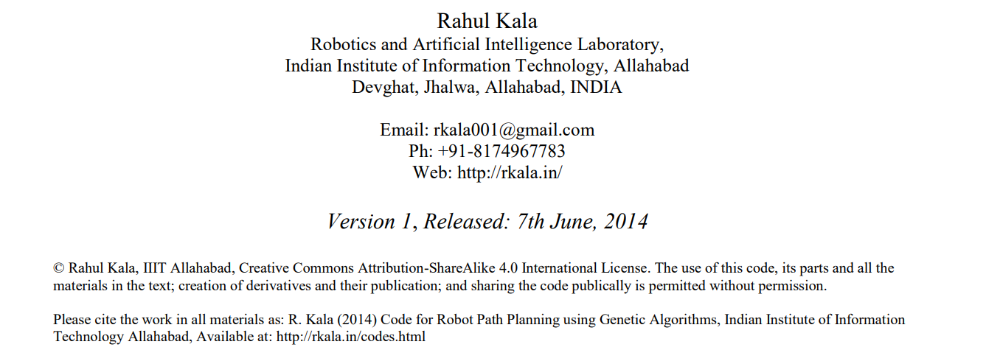

# Path Planning Algorithms

# 作者

## 介绍

来自印度理工大学 机器人&人工智能实验室的**Rahul Kala**

他（她）整理了多种经典的路径规划算法，每一种都附有非常详细的说明文档

使用Matlab编写，对这些算法进行标准化的代码实现，而且还有清晰明了的可视化动画

## 各种算法

各种算法包括：

| 文件              | 算法                   |
| ----------------- | ---------------------- |
| A star            | A*                     |
| bidirectional RRT | 双向快速随机扩展树算法 |
| fuzzy             | 模糊逻辑算法           |
| GA                | 遗传算法               |
| potential         | 人工势场法             |
| PRM               | 概率路图算法           |
| RRT               | 快速随机扩展树算法     |

## 最后

欢迎学习！